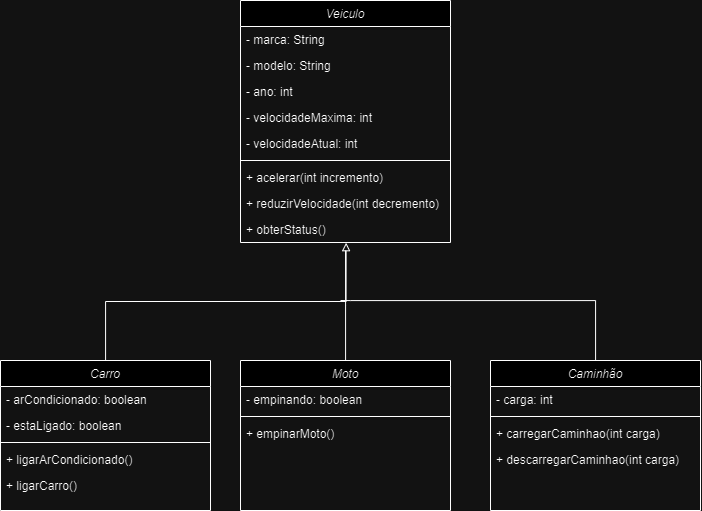

# Sistema de Gestão de Veículos :truck:
Exercício originalmente aplicado como atividade avaliatória e posteriormente corrigido em classe.

### Diagrama de Caso de Uso :construction:
O diagrama de Caso de Uso ilustra as principais atividades realizadas pelo sistema

### Diagrama de Classes :pencil:
O Diagrama de Caso de Uso   

